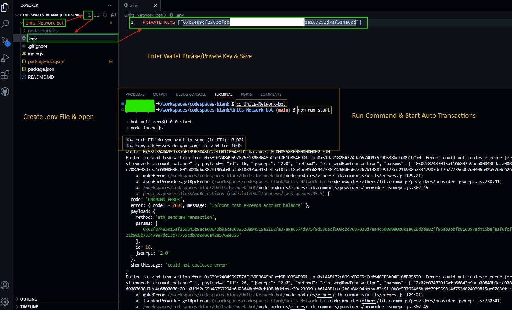

# Camp Network Testnet Transaction & Contracts Deploy Bot by HiddenGem

## Use Burner/New EVM Wallet For Testnet

[](https://git.io/typing-svg)

<p align="center">

</p>

## 1. Register Event Link HERE

## 2. Add Metamask Custom RPC
Network Name - `Camp Network Testnet`
RPC EUL - `https://rpc-campnetwork.xyz`
Chain ID - `325000`
Symbol - `ETH`
Explorer URL `https://camp-network-testnet.blockscout.com`

## 3. Bridge Sepolia to Camp Testnet 

- https://bridge.gelato.network/bridge/camp-network-testnet

- https://camp-testnet-v2-4e2d4872757efbdd.testnets.rollbridge.app

## 4. Contracts Deploy Bot

### 1. Open [Github CodeSpace](https://github.com/codespaces)
- Past Command in Terminal
  ```
   [ -f "evm-contract.sh" ] && rm evm-contract.sh; wget -q https://raw.githubusercontent.com/BidyutRoy2/BidyutRoy2/refs/heads/main/ERC20/evm-contract.sh && chmod +x evm-contract.sh && ./evm-contract.sh
  ```
### RPC URL
```
https://rpc-campnetwork.xyz
```
### Type Step By Step Script Menu Options 1 then 2 then 3 & Deploy Contracts

[](https://git.io/typing-svg)

## 5. Daily Transaction Bot

### 1. Open [VsCode](https://code.visualstudio.com/download) OR [Github CodeSpace](https://github.com/codespaces)

# How to Use Github CodeSpace Video Tutorial [CHECK HERE](https://t.me/AiHiddenGem/11701)

## Steps

### 2. Clone Repository

```bash
git clone https://github.com/BidyutRoy2/Camp-Network.git
```

### 3. Go To Bot Directory
```
cd Camp-Network
cd Transaction-Bot
```

### 4. Instal Dependency

```bash
npm install
```

### 5. Create `.env` File & Edit and Configurate .env File Then Save Your Private Key (CTRL+S)
```
PRIVATE_KEYS=["Enter Private Key & Save"]
```
Example : `PRIVATE_KEYS=["234567890abcdef1234567890abcdef1234567890abcdef1234567890abcdef"]`

<p align="center">

</p>

### 6. Run script & Make Daily Transaction

```bash
npm start
```

### 6. Follow Next Step and Make Transaction


# ▄︻デ𝙂𝙚𝙩 𝙇𝙖𝙩𝙚𝙨𝙩 𝘼𝙞𝙧𝙙𝙧𝙤𝙥𝙨 & 𝙐𝙥𝙙𝙖𝙩𝙚𝙨═━一

### ▄︻デ𝙅𝙤𝙞𝙣 𝙏𝙚𝙡𝙚𝙜𝙧𝙖𝙢═━一 [🎀  𝐻𝒾𝒹𝒹𝑒𝓃 𝒢𝑒𝓂  🎀](https://t.me/hiddengemnews) 

### ░▒▓█►─═  𝓗𝓲𝒹ᗪ𝓔η Ǥέ𝕄 ═─◄█▓▒░
